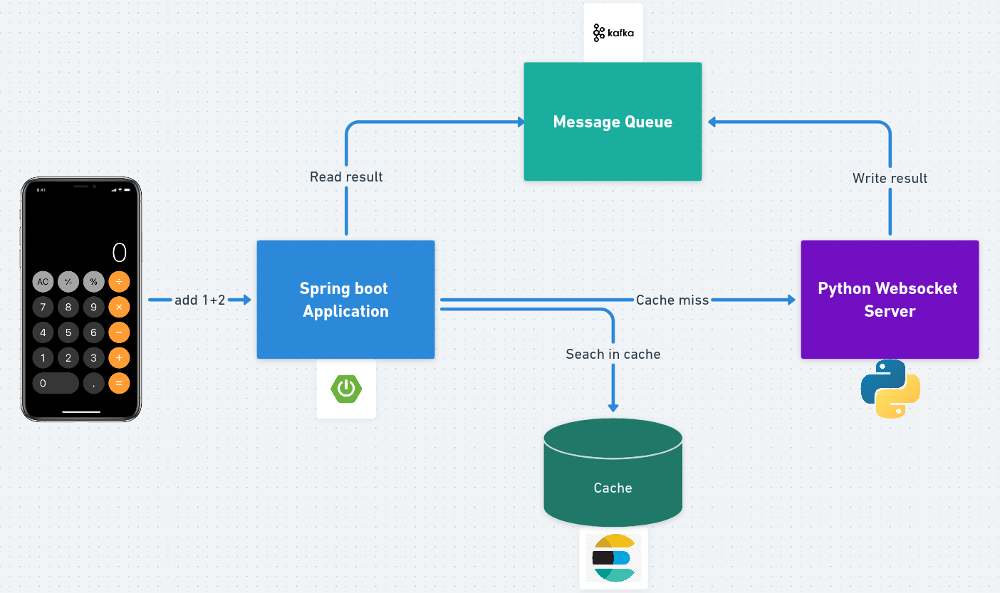

# unnecessarily-complicated-calculator
A calculator that does basic math operations. 

  

* Professor : A python web socket server ( This application is to compute the results)
* Nairobi   : A REST application written with Springboot ( This application is to handle the requests)
