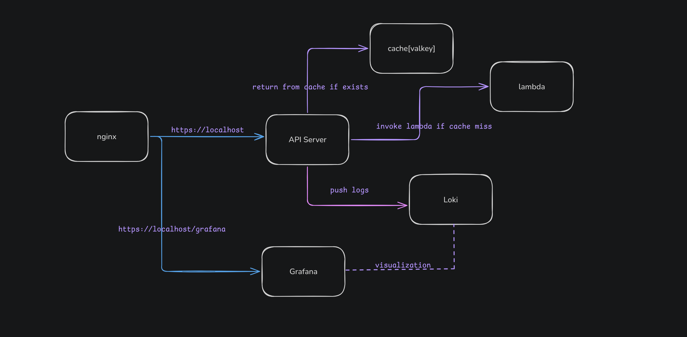

# unnecessarily-complicated-calculator

## Architecture


[](https://github.com/arjunraghurama/unnecessarily-complicated-calculator/actions/workflows/unit_test.yaml)

To run the project run the following command
```
docker compose up --build
```

To stop the project run the following command
```
docker compose down -v
```

Access [loki metrics](http://localhost:3100/metrics)

Access [backend api swagger](http://localhost:8000/docs) or `https` version [backend api swagger](https://localhost/docs) 

Access [lambda functions](http://localhost:8080/resources/lambda?function=basic-math-lambda-function)

Access [grafana dashboard](http://localhost:3000/grafana/dashboards) or `https` version [grafana dashboard](https://localhost/grafana/dashboards) 
